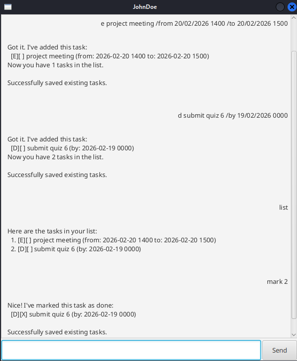

# JohnDoe User Guide

JohnDoe is a minimalist task management app. It provides:
1. adding and deletion of various task types
2. setting and unsetting if a task is done
3. task name search function

Note on command formats:
- fields in `UPPER_CASE` are to be supplied by the user
- example of date time format `dd/MM/yyyy HHmm`: `31/01/2026 1830`
- example of date time format `yyyy-MM-dd HHmm`: `2026-01-31 1830`

## In-app help: `help`
Shows the various available commands.

Format: `help`

## Adding a todo task: `todo`
Adds a task to the tasklist.

Format: `todo TASK_NAME`

Example: `todo watch lecture recording`

## Adding a deadline task: `deadline`
Adds a task with a deadline to the tasklist.

Format: `deadline TASK_NAME /by dd/MM/yyyy HHmm`

Example: `deadline week 3 iP /by 30/01/2026 1600`

## Adding an event task: `event`
Adds a task with a start and end time to the tasklist.

Format: `event TASK_NAME /from dd/MM/yyyy HHmm /to dd/MM/yyyy HHmm`

Example: `event tP meeting /from 30/01/2026 1800 /to 30/01/2026 1900`

## Listing existing tasks: `list`
Lists all existing tasks in the tasklist.

Format: `list`

## Deleting a task: `delete`
Deletes a specified task from the tasklist.

Format: `delete TASK_NUMBER`

Example: `delete 1`

## Mark a task as done: `mark`
Marks a specified task as done.

Format: `mark TASK_NUMBER`

Example: `mark 1`

## Unmark a task: `unmark`
Unmarks a specified task.

Format: `unmark TASK_NUMBER`

Example: `unmark 1`

## Search using taskname: `find`
Lists tasks that contain the given phrase in the name. Case-sensitive.

Format: `find KEY_WORDS`

Example: `find project meeting`

## Note on data persistence
JohnDoe uses `|` as delimiters when storing tasks in the storage file `./data/tasks.txt`.

`|` in task names are not filtered, but doing so will create invalid entries in the storage file.

If the app detects an invalid entry, it will show the entry in the GUI, along with a formatting guide.

Please manually fix such entries before trying to reopen the app.
